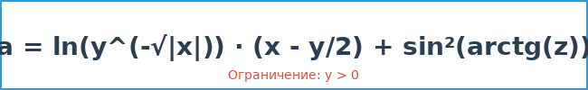
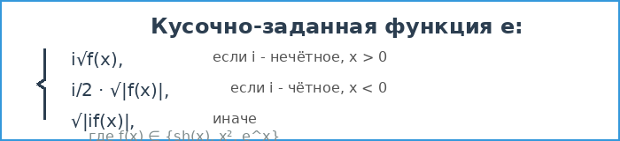

# Практическая работа №4. Тестирование "белым ящиком". Часть 1

## Информация о работе

**Дисциплина:** Тестирование программного обеспечения

**Название:** Практическая работа №4 - Тестирование "белым ящиком" (Часть 1)

**Цель работы:** Приобрести практические навыки ручного тестирования методом "белого ящика"

## Разработчики

**Учебная группа:** 123

**Разработчики:**
- Солдатов
- Дудченко

## Вариант задания

**Вариант №5**

### Страница 1: Функция a

Формула:
```
a = ln(y^(-√|x|)) · (x - y/2) + sin²(arctg(z))
```

**Параметры ввода:**
- x - действительное число
- y - действительное число (должно быть > 0)
- z - действительное число

**Ограничения:**
- y > 0 (для корректного вычисления логарифма)



---

### Страница 2: Кусочно-заданная функция e

Формула:
```
e = {
    i√f(x),       если i - нечётное, x > 0
    i/2·√|f(x)|,  если i - чётное, x < 0
    √|if(x)|,     иначе
}
```

Где f(x) может принимать значения:
- sh(x) - гиперболический синус
- x²
- e^x

**Параметры ввода:**
- x - действительное число
- i - целое число (для определения чётности)
- Выбор функции f(x) через радиокнопки



---

### Страница 3: Функция y с графиком

Формула:
```
y = x⁴ + cos(2 + x³ - b)
```

**Параметры:**
- x₀ = 4.6 (начальное значение)
- xₖ = 5.8 (конечное значение)
- dx = 0.2 (шаг)
- b = 1.3 (константа)

**Функционал:**
- Вычисление значений функции в цикле от x₀ до xₖ с шагом dx
- Вывод таблицы значений x и y
- Построение графика функции


---

## Используемый стек технологий

- **Язык программирования:** C#
- **Фреймворк:** .NET Framework 4.7.2
- **UI Framework:** WPF (Windows Presentation Foundation)
- **Библиотека для графиков:** LiveCharts.Wpf v0.9.7
- **IDE:** Microsoft Visual Studio
- **Система контроля версий:** Git
- **Платформа хостинга:** GitHub
- **Тестирование:** MSTest Framework v2.2.7
- **Архитектурный паттерн:** Разделение бизнес-логики и UI

## Архитектура приложения

Приложение построено по архитектуре **WPF с многостраничной навигацией** и **разделением ответственности**.

### Принципы архитектуры:

1. **Separation of Concerns** - разделение бизнес-логики и UI
2. **Testability** - возможность модульного тестирования
3. **Single Responsibility** - каждый класс отвечает за одну задачу

### Структура проекта:

```
PractWork4_Soldatov_Dudchenko/
│
├── App.xaml                    # Точка входа приложения
├── App.xaml.cs
│
├── MainWindow.xaml             # Главное окно с навигацией
├── MainWindow.xaml.cs
│
├── BusinessLogic/              # ⭐ Бизнес-логика (тестируемая)
│   └── MathFunctions.cs        # Все математические функции
│
├── Page1.xaml                  # Страница 1: Функция a (UI)
├── Page1.xaml.cs
│
├── Page2.xaml                  # Страница 2: Функция e (UI)
├── Page2.xaml.cs
│
├── Page3.xaml                  # Страница 3: Функция y с графиком (UI)
├── Page3.xaml.cs
│
├── formula1.png                # Изображения формул
├── formula2.png
├── formula3.png
│
└── README.md                   # Документация проекта
```

### Тестовый проект:

```
UnitTestProject/
│
├── FunctionATests.cs           # 8 unit-тестов для функции A
├── FunctionETests.cs           # 13 unit-тестов для функции E
├── FunctionYTests.cs           # 15 unit-тестов для функции Y
│
└── UnitTestProject.csproj      # Конфигурация тестового проекта
```

**Всего тестов: 36**

### Основные компоненты:

1. **MainWindow** - главное окно с меню навигации между страницами
2. **BusinessLogic/MathFunctions** - класс с бизнес-логикой всех трёх функций
3. **Page1** - UI для расчёта первой математической функции
4. **Page2** - UI для расчёта кусочно-заданной функции с выбором f(x)
5. **Page3** - UI для расчёта функции в цикле с построением графика
6. **UnitTestProject** - проект с автоматизированными unit-тестами

### Проведённый рефакторинг:

✅ **Выделена бизнес-логика** в отдельный класс `MathFunctions`  
✅ **Разделены ответственности** - UI отделён от вычислений  
✅ **Добавлены XML-комментарии** ко всем публичным методам  
✅ **Улучшена обработка ошибок** - типизированные исключения  
✅ **Создано 36 unit-тестов** для всех трёх функций

### Особенности реализации:

- **Валидация входных данных** - проверка на заполненность полей и корректность числовых значений
- **Обработка исключений** - все математические операции защищены от ошибок
- **Подтверждение выхода** - при закрытии приложения запрашивается подтверждение
- **Всплывающие подсказки** - для всех элементов интерфейса добавлены ToolTip
- **Блокировка полей результата** - поля вывода результатов доступны только для чтения
- **Очистка полей** - кнопка "Очистить" для сброса всех введённых данных

## Функциональные возможности

### Страница 1:
- Ввод параметров x, y, z
- Вычисление сложной математической функции
- Проверка ограничений (y > 0)
- Вывод результата с точностью до 10 знаков

### Страница 2:
- Ввод параметров x, i
- Выбор функции f(x) из трёх вариантов (sh(x), x², e^x)
- Вычисление кусочно-заданной функции с тремя условиями
- Вывод результата с точностью до 10 знаков

### Страница 3:
- Автоматическое вычисление функции в цикле
- Вывод таблицы значений x и y
- Построение интерактивного графика функции
- Визуализация результатов с помощью библиотеки LiveCharts

## Unit-тестирование (Тестирование "белым ящиком")

Проект включает полный набор автоматизированных модульных тестов для всех математических функций.

### Статистика тестов:

- **FunctionATests** - 8 тестов для функции A
  - Тесты корректных вычислений
  - Тесты граничных случаев
  - Тесты исключений при некорректных данных

- **FunctionETests** - 13 тестов для функции E
  - Тесты всех трёх условий кусочной функции
  - Тесты для sh(x), x², e^x
  - Тесты граничных случаев

- **FunctionYTests** - 15 тестов для функции Y
  - Тесты одиночного вычисления
  - Тесты вычисления диапазона
  - Тесты проверки параметров варианта 5

**Всего: 36 unit-тестов** ✅

### Покрытие кода тестами:

```
MathFunctions.CalculateFunctionA()     ✅ 100%
MathFunctions.CalculateFunctionE()     ✅ 100%
MathFunctions.CalculateFunctionY()     ✅ 100%
MathFunctions.CalculateFunctionYRange() ✅ 100%
```

### Как запустить тесты:

1. Откройте решение в Visual Studio
2. Меню: **Test → Test Explorer**
3. Нажмите **"Run All"**
4. Все 36 тестов должны пройти успешно (зелёные ✅)

Подробная инструкция: см. файл `UNIT_TESTS_GUIDE.md`

## Инструкция по запуску

1. Клонировать репозиторий:
```bash
git clone https://github.com/ваш_логин/PractWork4_Soldatov_Dudchenko.git
```

2. Открыть проект в Microsoft Visual Studio

3. Восстановить NuGet пакеты (LiveCharts.Wpf)

4. Собрать решение (Build → Build Solution)

5. Запустить приложение (F5 или Debug → Start Debugging)

## Требования к системе

- **ОС:** Windows 7/8/10/11
- **.NET Framework:** 4.7.2 или выше
- **Разрешение экрана:** минимум 1024x768

## Скриншоты

### Главное окно


### Страница 1 - Функция a


### Страница 2 - Функция e


### Страница 3 - График функции y


## Примеры использования

### Страница 1:
**Входные данные:**
- x = 2
- y = 3
- z = 1

**Результат:** a ≈ -0.2768361992

### Страница 2:
**Входные данные:**
- x = 1
- i = 3 (нечётное)
- f(x) = sh(x)

**Результат:** e ≈ 3.5257706608

### Страница 3:
Автоматически вычисляется для x от 4.6 до 5.8 с шагом 0.2

## Контакты

По вопросам работы приложения обращаться к разработчикам:
- Солдатов (группа 123)
- Дудченко (группа 123)

---

**Преподаватель:** TGAksenova

**Дата разработки:** 2026

**Версия:** 1.0
