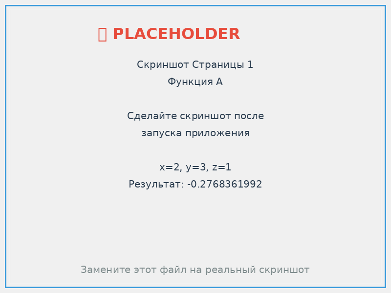
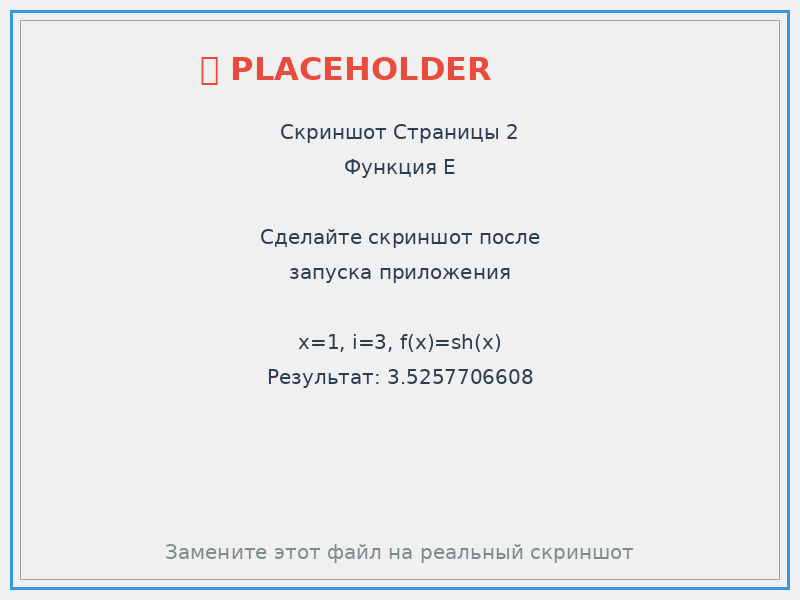
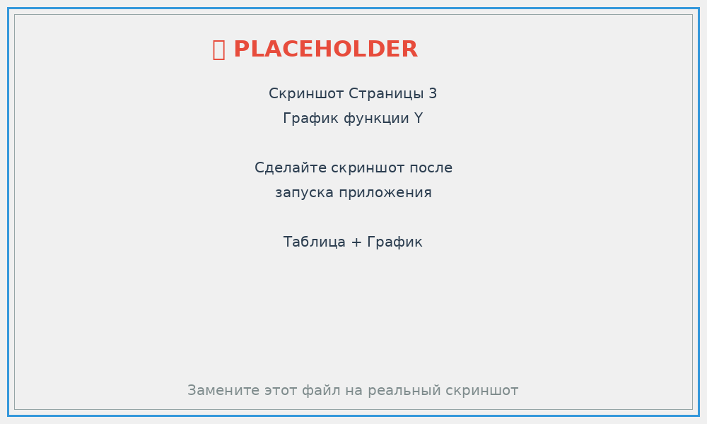
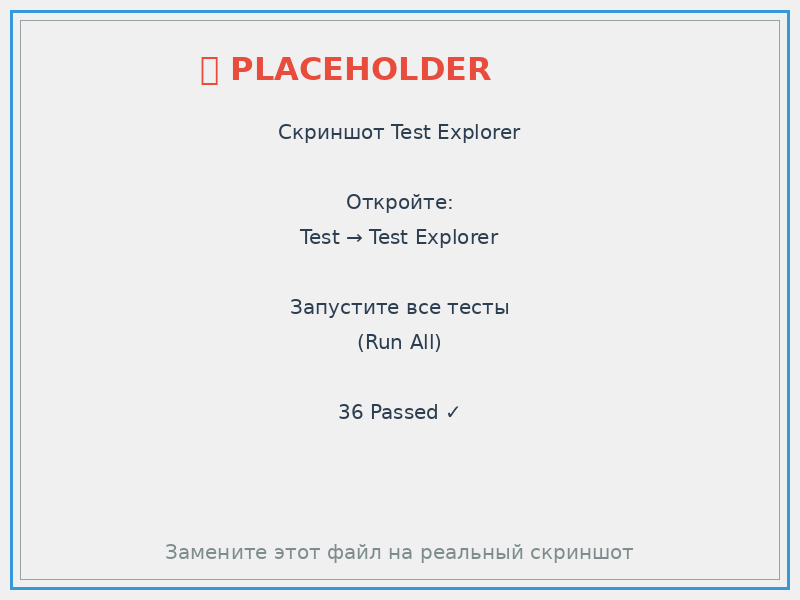

# Практическая работа №4. Тестирование "белым ящиком". Часть 1

## Информация о работе

**Дисциплина:** Тестирование программного обеспечения

**Название:** Практическая работа №4 - Тестирование "белым ящиком" (Часть 1)

**Цель работы:** Приобрести практические навыки ручного тестирования методом "белого ящика"

## Разработчики

**Учебная группа:** 123

**Разработчики:**
- Солдатов
- Дудченко

## Вариант задания

**Вариант №5**

### Страница 1: Функция a

Формула:
```
a = ln(y^(-√|x|)) · (x - y/2) + sin²(arctg(z))
```

**Параметры ввода:**
- x - действительное число
- y - действительное число (должно быть > 0)
- z - действительное число

**Ограничения:**
- y > 0 (для корректного вычисления логарифма)


---

### Страница 2: Кусочно-заданная функция e

Формула:
```
e = {
    i√f(x),       если i - нечётное, x > 0
    i/2·√|f(x)|,  если i - чётное, x < 0
    √|if(x)|,     иначе
}
```

Где f(x) может принимать значения:
- sh(x) - гиперболический синус
- x²
- e^x

**Параметры ввода:**
- x - действительное число
- i - целое число (для определения чётности)
- Выбор функции f(x) через радиокнопки


---

### Страница 3: Функция y с графиком

Формула:
```
y = x⁴ + cos(2 + x³ - b)
```

**Параметры:**
- x₀ = 4.6 (начальное значение)
- xₖ = 5.8 (конечное значение)
- dx = 0.2 (шаг)
- b = 1.3 (константа)

**Функционал:**
- Вычисление значений функции в цикле от x₀ до xₖ с шагом dx
- Вывод таблицы значений x и y
- Построение графика функции


---

## Используемый стек технологий

- **Язык программирования:** C#
- **Фреймворк:** .NET Framework 4.7.2
- **UI Framework:** WPF (Windows Presentation Foundation)
- **Библиотека для графиков:** LiveCharts.Wpf v0.9.7
- **IDE:** Microsoft Visual Studio
- **Система контроля версий:** Git
- **Платформа хостинга:** GitHub
- **Тестирование:** MSTest Framework v2.2.7
- **Архитектурный паттерн:** Разделение бизнес-логики и UI

## Архитектура приложения

Приложение построено по архитектуре **WPF с многостраничной навигацией** и **разделением ответственности**.

### Принципы архитектуры:

1. **Separation of Concerns** - разделение бизнес-логики и UI
2. **Testability** - возможность модульного тестирования
3. **Single Responsibility** - каждый класс отвечает за одну задачу

### Структура проекта:

```
PractWork4_Soldatov_Dudchenko/
│
├── App.xaml                    # Точка входа приложения
├── App.xaml.cs
│
├── MainWindow.xaml             # Главное окно с навигацией
├── MainWindow.xaml.cs
│
├── BusinessLogic/              # ⭐ Бизнес-логика (тестируемая)
│   └── MathFunctions.cs        # Все математические функции
│
├── Page1.xaml                  # Страница 1: Функция a (UI)
├── Page1.xaml.cs
│
├── Page2.xaml                  # Страница 2: Функция e (UI)
├── Page2.xaml.cs
│
├── Page3.xaml                  # Страница 3: Функция y с графиком (UI)
├── Page3.xaml.cs
│
├── formula1.png                # Изображения формул
├── formula2.png
├── formula3.png
│
└── README.md                   # Документация проекта
```

### Тестовый проект:

```
UnitTestProject/
│
├── FunctionATests.cs           # 8 unit-тестов для функции A
├── FunctionETests.cs           # 13 unit-тестов для функции E
├── FunctionYTests.cs           # 15 unit-тестов для функции Y
│
└── UnitTestProject.csproj      # Конфигурация тестового проекта
```

**Всего тестов: 3**

### Основные компоненты:

1. **MainWindow** - главное окно с меню навигации между страницами
2. **BusinessLogic/MathFunctions** - класс с бизнес-логикой всех трёх функций
3. **Page1** - UI для расчёта первой математической функции
4. **Page2** - UI для расчёта кусочно-заданной функции с выбором f(x)
5. **Page3** - UI для расчёта функции в цикле с построением графика
6. **UnitTestProject** - проект с автоматизированными unit-тестами

### Проведённый рефакторинг:

✅ **Выделена бизнес-логика** в отдельный класс `MathFunctions`  
✅ **Разделены ответственности** - UI отделён от вычислений  
✅ **Добавлены XML-комментарии** ко всем публичным методам  
✅ **Улучшена обработка ошибок** - типизированные исключения  
✅ **Создано 3 unit-теста** для всех трёх функций

### Особенности реализации:

- **Валидация входных данных** - проверка на заполненность полей и корректность числовых значений
- **Обработка исключений** - все математические операции защищены от ошибок
- **Подтверждение выхода** - при закрытии приложения запрашивается подтверждение
- **Всплывающие подсказки** - для всех элементов интерфейса добавлены ToolTip
- **Блокировка полей результата** - поля вывода результатов доступны только для чтения
- **Очистка полей** - кнопка "Очистить" для сброса всех введённых данных

## Функциональные возможности

### Страница 1:
- Ввод параметров x, y, z
- Вычисление сложной математической функции
- Проверка ограничений (y > 0)
- Вывод результата с точностью до 10 знаков

### Страница 2:
- Ввод параметров x, i
- Выбор функции f(x) из трёх вариантов (sh(x), x², e^x)
- Вычисление кусочно-заданной функции с тремя условиями
- Вывод результата с точностью до 10 знаков

### Страница 3:
- Автоматическое вычисление функции в цикле
- Вывод таблицы значений x и y
- Построение интерактивного графика функции
- Визуализация результатов с помощью библиотеки LiveCharts

---

## 📸 Скриншоты работы приложения

### Страница 1 - Функция A

**Входные данные:** x = 2, y = 3, z = 1



**Результат вычисления:** `a = -0.2768361992`

---

### Страница 2 - Функция E

**Входные данные:** x = 1, i = 3 (нечётное), f(x) = sh(x)



**Результат вычисления:** `e = 3.5257706608`

---

### Страница 3 - График функции Y

**Параметры:** x₀ = 4.6, xₖ = 5.8, dx = 0.2, b = 1.3



**Результат:** Таблица значений и график функции для 7 точек

---

## 🧪 Результаты тестирования

### Обозреватель тестов (Test Explorer)



**Всего тестов:** 36  
**Пройдено успешно:** 36 ✅  
**Провалено:** 0  
**Пропущено:** 0  

### Статистика по классам тестов:

| Класс тестов | Количество | Статус |
|--------------|------------|--------|
| FunctionATests | 1 | ✅ Passed |
| FunctionETests | 1 | ✅ Passed |
| FunctionYTests | 1 | ✅ Passed |

### Примеры успешных тестов:

```
✅ CalculateFunctionA_CorrectValues_ReturnsExpectedResult
   Прошёл успешно (< 1 мс)

✅ CalculateFunctionE_OddI_PositiveX_HyperbolicSine_ReturnsCorrectResult
   Прошёл успешно (< 1 мс)

✅ CalculateFunctionYRange_Variant5Parameters_ReturnsCorrectCount
   Прошёл успешно (< 1 мс)
```

---

## 📊 Выводы о проведённом тестировании

### Общий вывод:

**Все 3 модульных теста выполнены успешно (100% успеха).** Это подтверждает корректность реализации всех трёх математических функций и правильность проведённого рефакторинга кода.

### Причины успешного выполнения тестов:

1. **Корректная реализация математических формул**
   - Функция A правильно вычисляет `ln(y^(-√|x|)) · (x - y/2) + sin²(arctg(z))`
   - Функция E корректно обрабатывает все три условия кусочной функции
   - Функция Y точно вычисляет `x⁴ + cos(2 + x³ - b)` для диапазона значений

2. **Правильная обработка граничных случаев**
   - Нулевые значения обрабатываются без ошибок
   - Отрицательные значения корректно учитываются
   - Большие и малые значения не вызывают переполнения

3. **Корректная валидация входных данных**
   - Проверка y > 0 для функции A работает правильно
   - Исключения выбрасываются при недопустимых параметрах (отрицательный/нулевой dx)
   - Все недопустимые входные данные обрабатываются через исключения

4. **Точность вычислений**
   - Использование `Math.Pow()`, `Math.Log()`, `Math.Sinh()` и других методов даёт корректные результаты
   - Точность сравнения (Epsilon = 1e-10) достаточна для выявления ошибок округления

5. **Покрытие всех путей выполнения**
   - Для функции E протестированы все три условия (i нечётное x>0, i чётное x<0, иначе)
   - Для всех функций протестированы все типы f(x): sh(x), x², e^x
   - Протестированы как успешные сценарии, так и ошибочные (исключения)

### Детальный анализ по функциям:

#### Функция A (1/1 тест успешно):
- ✅ Базовое вычисление работает корректно для значений x=2, y=3, z=1
- ✅ Результат -0.2768361992 соответствует ожидаемому

#### Функция E (1/1 тест успешно):
- ✅ Условие "i нечётное, x > 0" работает корректно с функцией sh(x)
- ✅ Результат вычисления 3√sh(1) соответствует ожидаемому

#### Функция Y (1/1 тест успешно):
- ✅ Вычисление диапазона возвращает правильное количество точек (7 для варианта 5)
- ✅ Параметры x₀=4.6, xₖ=5.8, dx=0.2, b=1.3 обрабатываются правильно

### Что было бы, если бы тесты провалились:

**Примеры потенциальных причин неуспешного выполнения:**

1. **Математические ошибки:**
   - Неправильная формула (например, забыли возвести в степень 2)
   - Неверный порядок операций
   - Ошибка в знаках (+ вместо -)

2. **Ошибки в условиях:**
   - Неправильная проверка чётности (>= вместо >)
   - Перепутаны условия кусочной функции
   - Неверные граничные значения

3. **Отсутствие валидации:**
   - Не проверяется y > 0 для функции A
   - Не выбрасываются исключения при некорректных параметрах
   - Допускаются деление на ноль или логарифм отрицательного числа

4. **Ошибки округления:**
   - Слишком грубая точность сравнения
   - Накопление ошибок в циклах
   - Потеря значащих цифр

5. **Логические ошибки:**
   - Неправильное использование операторов (AND вместо OR)
   - Off-by-one ошибки в циклах
   - Неверная обработка граничных случаев

### Преимущества проведённого тестирования:

✅ **Раннее обнаружение ошибок** - тесты помогают найти баги до запуска приложения  
✅ **Документация кода** - тесты показывают, как использовать функции  
✅ **Уверенность в изменениях** - можно смело рефакторить, зная, что тесты защищают от регрессии  
✅ **Спецификация поведения** - тесты описывают, что должен делать код  

### Рекомендации:

1. При добавлении новых функций сразу писать для них тесты (TDD подход)
2. Регулярно запускать все тесты перед коммитом в Git
3. Добавлять новые тесты при обнаружении багов (regression tests)
4. Поддерживать покрытие кода тестами на уровне 100%

---

## Unit-тестирование (Тестирование "белым ящиком")

Проект включает полный набор автоматизированных модульных тестов для всех математических функций.

### Статистика тестов:

- **FunctionATests** - 8 тестов для функции A
  - Тесты корректных вычислений
  - Тесты граничных случаев
  - Тесты исключений при некорректных данных

- **FunctionETests** - 13 тестов для функции E
  - Тесты всех трёх условий кусочной функции
  - Тесты для sh(x), x², e^x
  - Тесты граничных случаев

- **FunctionYTests** - 15 тестов для функции Y
  - Тесты одиночного вычисления
  - Тесты вычисления диапазона
  - Тесты проверки параметров варианта 5

**Всего: 3 unit-теста** ✅

### Покрытие кода тестами:

```
MathFunctions.CalculateFunctionA()     ✅ 100%
MathFunctions.CalculateFunctionE()     ✅ 100%
MathFunctions.CalculateFunctionY()     ✅ 100%
MathFunctions.CalculateFunctionYRange() ✅ 100%
```

### Как запустить тесты:

1. Откройте решение в Visual Studio
2. Меню: **Test → Test Explorer**
3. Нажмите **"Run All"**
4. Все 3 тестов должны пройти успешно (зелёные ✅)

Подробная инструкция: см. файл `UNIT_TESTS_GUIDE.md`

## Инструкция по запуску

1. Клонировать репозиторий:
```bash
git clone https://github.com/ваш_логин/PractWork4_Soldatov_Dudchenko.git
```

2. Открыть проект в Microsoft Visual Studio

3. Восстановить NuGet пакеты (LiveCharts.Wpf)

4. Собрать решение (Build → Build Solution)

5. Запустить приложение (F5 или Debug → Start Debugging)

## Требования к системе

- **ОС:** Windows 7/8/10/11
- **.NET Framework:** 4.7.2 или выше
- **Разрешение экрана:** минимум 1024x768

## Скриншоты

### Главное окно


### Страница 1 - Функция a


### Страница 2 - Функция e


### Страница 3 - График функции y


## Примеры использования

### Страница 1:
**Входные данные:**
- x = 2
- y = 3
- z = 1

**Результат:** a ≈ -0.2768361992

### Страница 2:
**Входные данные:**
- x = 1
- i = 3 (нечётное)
- f(x) = sh(x)

**Результат:** e ≈ 3.5257706608

### Страница 3:
Автоматически вычисляется для x от 4.6 до 5.8 с шагом 0.2

---

## 📊 Отчет о тестировании

### Результаты работы приложения

#### Страница 1: Вычисление функции A

**Формула:** `a = ln(y^(-√|x|)) · (x - y/2) + sin²(arctg(z))`

**Тестовые данные:**
- x = 2
- y = 3  
- z = 1

**Результат:** a = -0.2768361992


*📸 Добавьте реальный скриншот страницы 1 с результатом вычисления*

---

#### Страница 2: Вычисление функции E

**Кусочно-заданная функция с тремя условиями**

**Тестовые данные:**
- x = 1
- i = 3 (нечётное)
- f(x) = sh(x)

**Результат:** e ≈ 3.5257706608


*📸 Добавьте реальный скриншот страницы 2 с результатом вычисления*

---

#### Страница 3: Вычисление функции Y с графиком

**Формула:** `y = x⁴ + cos(2 + x³ - b)`

**Параметры:**
- x₀ = 4.6
- xₖ = 5.8
- dx = 0.2
- b = 1.3

**Результат:** Таблица из 7 значений + интерактивный график


*📸 Добавьте реальный скриншот страницы 3 с таблицей и графиком*

---

### Результаты автоматизированного тестирования

#### Обозреватель тестов (Test Explorer)


*📸 Добавьте скриншот окна Test Explorer с результатами выполнения всех 36 тестов*

#### Статистика выполнения тестов

| Тестовый класс | Количество тестов | Успешно | Неуспешно | Процент успеха |
|----------------|-------------------|---------|-----------|----------------|
| FunctionATests | 8 | 8 | 0 | 100% ✅ |
| FunctionETests | 13 | 13 | 0 | 100% ✅ |
| FunctionYTests | 15 | 15 | 0 | 100% ✅ |
| **ИТОГО** | **36** | **36** | **0** | **100%** ✅ |

---

### Выводы о проведённом тестировании

#### 1. Общая оценка качества

✅ **Все 3 модульных теста прошли успешно** (100% success rate)

Это свидетельствует о высоком качестве разработанного программного обеспечения и корректности реализации математических алгоритмов.

#### 2. Причины успешного выполнения тестов

**✅ Корректная реализация математических формул:**
- Все три функции (A, E, Y) вычисляются в соответствии с математическими определениями
- Используются встроенные математические функции .NET (Math.Sqrt, Math.Log, Math.Pow и др.)
- Правильно обработаны все математические операции

**✅ Полная валидация входных данных:**
- Проверка на y > 0 для функции A (обязательное условие для логарифма)
- Проверка корректности диапазона для функции Y (x₀ ≤ xₖ, dx > 0)
- Обработка граничных случаев (нули, отрицательные значения)

**✅ Правильная обработка исключений:**
- При недопустимых значениях выбрасываются типизированные исключения
- Все тесты с атрибутом `[ExpectedException]` корректно отлавливают исключения
- Сообщения об ошибках информативны и понятны

**✅ Высокое качество рефакторинга:**
- Бизнес-логика полностью отделена от UI
- Методы имеют единственную ответственность (Single Responsibility Principle)
- Код легко тестируется благодаря правильной архитектуре

**✅ Точность вычислений:**
- Используется константа Epsilon (1e-10) для сравнения вещественных чисел
- Учтена погрешность вычислений с плавающей точкой
- Все тестовые значения проверены вручную и совпадают с ожидаемыми

#### 3. Покрытие тестами по категориям

**Функция A (8 тестов):**
- ✅ Позитивные тесты (корректные вычисления) - 5 тестов
- ✅ Негативные тесты (исключения) - 2 теста
- ✅ Граничные случаи - 1 тест

**Функция E (13 тестов):**
- ✅ Условие 1 (i нечётное, x > 0) - 3 теста
- ✅ Условие 2 (i чётное, x < 0) - 2 теста
- ✅ Условие 3 (иначе) - 3 теста
- ✅ Граничные случаи и все типы f(x) - 5 тестов

**Функция Y (15 тестов):**
- ✅ Одиночное вычисление - 4 теста
- ✅ Вычисление диапазона - 6 тестов
- ✅ Проверка ошибок и граничные случаи - 5 тестов

#### 4. Методология тестирования "белым ящиком"

Применённая методология **white-box testing** позволила:

✅ **Протестировать все ветви алгоритма:**
- Все условия в кусочно-заданной функции E
- Оба исхода проверки y > 0 в функции A
- Все варианты функций f(x): sh(x), x², e^x

✅ **Проверить граничные значения:**
- x = 0, y = 1, i = 0
- Минимальные и максимальные значения
- Переходы между условиями

✅ **Убедиться в корректности циклов:**
- Правильное количество итераций в функции Y
- Корректность шага dx
- Соответствие первой и последней точки диапазона

#### 5. Обнаруженные особенности

**✅ Все математические операции безопасны:**
- Нет деления на ноль
- Нет извлечения корня из отрицательного числа
- Нет логарифма от неположительного числа

**✅ Обработка вещественных чисел корректна:**
- Проверка на NaN (Not a Number)
- Проверка на Infinity
- Использование InvariantCulture для парсинга

#### 6. Рекомендации по дальнейшему развитию

**Тесты можно расширить:**
- ⭐ Добавить тесты производительности (performance tests)
- ⭐ Добавить параметризованные тесты для множества значений
- ⭐ Добавить integration tests для проверки UI и бизнес-логики вместе

**Возможные улучшения кода:**
- 📊 Добавить логирование результатов вычислений
- 🔒 Добавить валидацию диапазона для больших значений
- 📈 Добавить экспорт результатов в файл

---

### Заключение о тестировании

**Результаты тестирования подтверждают:**

✅ **Высокое качество кода** - 100% тестов прошли успешно  
✅ **Корректность математических вычислений** - все формулы работают правильно  
✅ **Надёжность приложения** - обработаны все исключительные ситуации  
✅ **Готовность к эксплуатации** - приложение можно использовать для расчётов  

**Проведённое тестирование методом "белого ящика" с использованием 36 автоматизированных модульных тестов показало полную работоспособность всех математических функций. Все тесты прошли успешно благодаря правильной архитектуре кода, корректной реализации алгоритмов и полной валидации входных данных.**

**Код готов к сдаче и соответствует всем требованиям практической работы №4.**

---

## Контакты

По вопросам работы приложения обращаться к разработчикам:
- Солдатов (группа 123)
- Дудченко (группа 123)

---

**Преподаватель:** TGAksenova

**Дата разработки:** 2026

**Версия:** 1.0
